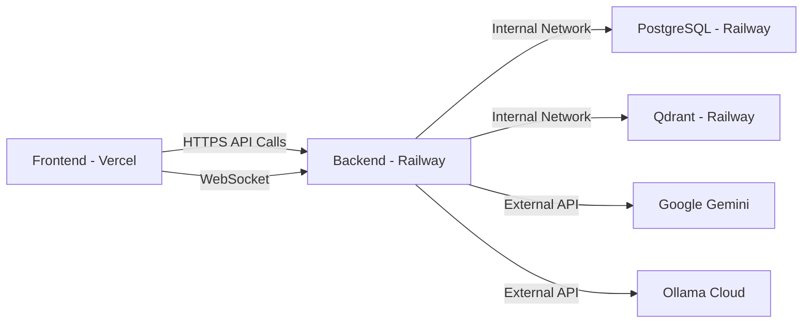

# ULTRA v3.0 Project Initialization Design

## Document Information

**Purpose**: Step 1 of PEGT - Project initialization and startup file generation for ULTRA v3.0 monorepo  
**Scope**: Backend and Frontend initial configuration files based on the Master Blueprint  
**Target Environment**: Railway (Backend, PostgreSQL, Qdrant) + Vercel (Frontend)

---

## 1. Project Overview

### 1.1 Objective

Initialize the ULTRA v3.0 cognitive sales engine project by generating all essential startup files and configuration based exclusively on the 11 Master Blueprint files provided. This includes:

- Complete monorepo directory structure
- Backend dependency management
- Frontend dependency management  
- Environment configuration templates
- Docker containerization for Railway deployment

### 1.2 Master Blueprint Sources

The design is derived from:
- **00_Wizja_Strategiczna_FINAL.md** - Strategic vision
- **01_SUPER_BLUEPRINT_FINAL.md** - Complete system specification
- **02_PEGT_FINAL.md** - Technical execution plan
- **seed.py** - Database seeding logic and dependencies
- **design_tokens.json** - UI design system
- **i18n_locales.json** - Internationalization resources
- **DATA_01_RAG.md** - RAG knowledge base
- **DATA_02_Golden_Standards.md** - Golden standards dataset
- **BIGD12.md** - Ollama Cloud API documentation

---

## 2. Directory Structure Design

### 2.1 Monorepo Layout

The project follows a monorepo structure with clear separation between backend and frontend:

```
decoder/
├── backend/
│   ├── app/
│   │   ├── __init__.py
│   │   ├── main.py
│   │   ├── models.py
│   │   ├── routes/
│   │   ├── services/
│   │   └── utils/
│   ├── requirements.txt
│   ├── .env.example
│   ├── Dockerfile
│   └── seed.py
├── frontend/
│   ├── src/
│   │   ├── components/
│   │   ├── views/
│   │   ├── stores/
│   │   ├── utils/
│   │   └── App.tsx
│   ├── public/
│   ├── package.json
│   └── .env.example
├── design_tokens.json
├── i18n_locales.json
├── DATA_01_RAG.md
└── DATA_02_Golden_Standards.md
```

### 2.2 Directory Purpose

| Directory | Purpose |
|-----------|---------|
| `backend/` | Python FastAPI orchestrator service |
| `backend/app/` | Application source code |
| `backend/app/routes/` | API endpoint definitions |
| `backend/app/services/` | Business logic and AI orchestration |
| `backend/app/utils/` | Helper functions and utilities |
| `frontend/` | React/TypeScript UI application |
| `frontend/src/components/` | Reusable UI components |
| `frontend/src/views/` | Page-level views (Dashboard, Conversation, Admin) |
| `frontend/src/stores/` | Zustand state management |

---

## 3. Backend Configuration Design

### 3.1 Python Dependencies (requirements.txt)

The backend requires the following categories of dependencies:

#### 3.1.1 Core Framework
- **fastapi** - Main API framework (SUPER-BLUEPRINT Section 1.4)
- **uvicorn** - ASGI server for FastAPI (SUPER-BLUEPRINT Section 5)
- **pydantic** - Data validation and settings management

#### 3.1.2 Database Connectivity
- **psycopg2-binary** - PostgreSQL adapter (seed.py line 7, PEGT Module 2)
- **asyncpg** - Async PostgreSQL support for FastAPI

#### 3.1.3 Vector Database
- **qdrant-client** - Qdrant vector database client (seed.py line 8, PEGT Module 2)

#### 3.1.4 AI & ML Components
- **sentence-transformers** - Embedding generation (seed.py line 9, PEGT Module 2, 11.1)
- **google-generativeai** - Google Gemini API client (SUPER-BLUEPRINT Addendum v1.1, PEGT Module 7)

#### 3.1.5 External AI Services
- **ollama** - Ollama Cloud client for DeepSeek (PEGT Module 7)
- **tenacity** - Retry logic with exponential backoff (SUPER-BLUEPRINT v1.1, PEGT Module 7, 11.4)

#### 3.1.6 Utilities
- **python-dotenv** - Environment variable management
- **python-multipart** - Form data handling
- **websockets** - WebSocket support for real-time updates (PEGT Module 11.3)

### 3.2 Dependency Versions Strategy

All dependencies will use compatible version constraints to ensure:
- Stability through tested versions
- Flexibility for security patches
- Compatibility across Railway deployment environment

---

## 4. Frontend Configuration Design

### 4.1 Technology Stack Selection

Based on SUPER-BLUEPRINT Section 1.4 and PEGT Module 9:
- **Framework**: React with TypeScript
- **State Management**: Zustand (preferred, PEGT Module 4)
- **Charting**: Recharts (SUPER-BLUEPRINT v1.1, PEGT Module 9)
- **Icons**: Heroicons (SUPER-BLUEPRINT v1.1, PEGT Module 9)

### 4.2 Package Dependencies (package.json)

#### 4.2.1 Core Framework
- **react** - UI library
- **react-dom** - React DOM rendering
- **typescript** - Type safety

#### 4.2.2 Build Tools
- **vite** - Fast build tool and dev server
- **@vitejs/plugin-react** - React plugin for Vite

#### 4.2.3 State Management
- **zustand** - Lightweight state management (PEGT Module 4)

#### 4.2.4 UI Components
- **recharts** - Charting library for analytics (PEGT Module 9)
- **@heroicons/react** - Icon library (PEGT Module 9)

#### 4.2.5 Routing
- **react-router-dom** - Client-side routing for Views 1, 2, 3

#### 4.2.6 HTTP & WebSocket
- **axios** - HTTP client for API calls
- **socket.io-client** or native WebSocket - Real-time communication (PEGT Module 11.3)

#### 4.2.7 Development Dependencies
- **@types/react** - React TypeScript definitions
- **@types/react-dom** - React DOM TypeScript definitions
- **eslint** - Code linting
- **prettier** - Code formatting

### 4.3 Package.json Structure

The package.json must include:
- **name**: "ultra-frontend"
- **version**: "3.0.0"
- **type**: "module"
- **scripts**: dev, build, preview, lint
- **dependencies**: Runtime dependencies
- **devDependencies**: Build-time dependencies

---

## 5. Environment Configuration Design

### 5.1 Backend Environment Variables (.env.example)

The backend requires comprehensive environment configuration across multiple categories:

#### 5.1.1 Database Configuration (from seed.py)
| Variable | Purpose | Example Value |
|----------|---------|---------------|
| `POSTGRES_USER` | PostgreSQL username | `ultra_user` |
| `POSTGRES_PASSWORD` | PostgreSQL password | `secure_password_123` |
| `POSTGRES_HOST` | PostgreSQL host address | `postgres.railway.internal` |
| `POSTGRES_PORT` | PostgreSQL port | `5432` |
| `POSTGRES_DB` | Database name | `ultra_db` |

#### 5.1.2 Vector Database Configuration (from seed.py)
| Variable | Purpose | Example Value |
|----------|---------|---------------|
| `QDRANT_HOST` | Qdrant host URL | `qdrant.railway.internal` |
| `QDRANT_PORT` | Qdrant port | `6333` |

#### 5.1.3 AI API Configuration (from PEGT Module 7)
| Variable | Purpose | Example Value |
|----------|---------|---------------|
| `GEMINI_API_KEY` | Google Gemini API key | `your_gemini_api_key_here` |
| `OLLAMA_CLOUD_URL` | Ollama Cloud endpoint | `https://ollama.com` |
| `OLLAMA_API_KEY` | Ollama Cloud API key | `your_ollama_api_key_here` |

#### 5.1.4 Admin Authentication (from PEGT Module 5)
| Variable | Purpose | Example Value |
|----------|---------|---------------|
| `ADMIN_API_KEY` | Admin panel access key | `ULTRA_DOJO_KEY_8a4f9b2c_qoder_ai_2025` |

#### 5.1.5 Application Configuration
| Variable | Purpose | Example Value |
|----------|---------|---------------|
| `ENVIRONMENT` | Deployment environment | `production` |
| `LOG_LEVEL` | Logging verbosity | `INFO` |
| `CORS_ORIGINS` | Allowed frontend origins | `https://your-frontend.vercel.app` |

### 5.2 Frontend Environment Variables

The frontend requires minimal configuration:

| Variable | Purpose | Example Value |
|----------|---------|---------------|
| `VITE_API_BASE_URL` | Backend API endpoint | `https://your-backend.railway.app/api/v1` |
| `VITE_WS_URL` | WebSocket endpoint | `wss://your-backend.railway.app/api/v1/ws` |

---

## 6. Docker Configuration Design

### 6.1 Dockerfile Purpose

The Dockerfile enables containerized deployment of the FastAPI backend on Railway platform (SUPER-BLUEPRINT Section 5).

### 6.2 Dockerfile Requirements

#### 6.2.1 Base Image Selection
- **Base**: Python 3.11-slim or 3.12-slim
- **Rationale**: Balance between size, performance, and ML library compatibility

#### 6.2.2 Build Stages
The Dockerfile should follow multi-stage pattern:

1. **Builder Stage**: Install dependencies and create wheels
2. **Runtime Stage**: Copy only necessary artifacts

#### 6.2.3 Installation Steps
1. Set working directory to `/app`
2. Copy `requirements.txt`
3. Install system dependencies (if needed for psycopg2, etc.)
4. Install Python dependencies via pip
5. Copy application code
6. Copy data files (DATA_01_RAG.md, DATA_02_Golden_Standards.md, seed.py)
7. Set environment variables
8. Expose port 8000
9. Define startup command: `uvicorn app.main:app --host 0.0.0.0 --port 8000`

#### 6.2.4 Optimization Considerations
- Use `.dockerignore` to exclude unnecessary files
- Leverage layer caching for dependencies
- Run as non-root user for security
- Include health check endpoint

### 6.3 Railway-Specific Considerations

Railway deployment requirements:
- Port binding via `PORT` environment variable (default 8000)
- PostgreSQL and Qdrant services connected via internal networking
- Environment variables injected at runtime
- No hardcoded credentials in Dockerfile

---

## 7. Deployment Architecture

### 7.1 Railway Services Configuration

Per SUPER-BLUEPRINT Section 5, Railway hosts three services:

| Service | Type | Configuration |
|---------|------|---------------|
| **Backend** | FastAPI | Deployed from GitHub via Dockerfile |
| **PostgreSQL** | Database | Railway managed service |
| **Qdrant** | Vector DB | Railway template/Docker deployment |

### 7.2 Service Interconnection



### 7.3 Network Communication Flow

1. **Frontend to Backend**: Public HTTPS endpoint (Railway-provided URL)
2. **Backend to PostgreSQL**: Internal Railway network (postgres.railway.internal)
3. **Backend to Qdrant**: Internal Railway network (qdrant.railway.internal)
4. **Backend to AI Services**: External HTTPS APIs (Gemini, Ollama Cloud)

---

## 8. Data Seeding Strategy

### 8.1 Seed Script Role

The `seed.py` script (already provided) performs one-time data initialization:

1. **PostgreSQL Seeding**:
   - Create all database tables (sessions, conversation_log, slow_path_logs, feedback_logs, golden_standards)
   - Load golden standards from DATA_02_Golden_Standards.md
   - Insert test session (S-TEST-001)

2. **Qdrant Seeding**:
   - Create vector collection `ultra_rag_v1`
   - Generate embeddings using `paraphrase-multilingual-MiniLM-L12-v2`
   - Load RAG nuggets from DATA_01_RAG.md with language metadata

### 8.2 Execution Timing

The seed script should be executed:
- **When**: After Railway services are provisioned and environment variables configured
- **How**: Manual execution via Railway CLI or one-time deployment command
- **Idempotency**: Script is designed to be safely re-run (uses `IF NOT EXISTS`, `ON CONFLICT DO NOTHING`)

---

## 9. Design Tokens and Internationalization

### 9.1 Design Tokens Integration

The `design_tokens.json` file defines:
- **Font Family**: Inter sans-serif
- **Border Radius**: 0.75rem
- **Color Themes**: Light and Dark mode palettes

Frontend implementation must:
- Load design tokens at build time
- Generate CSS custom properties
- Support theme switching (Light/Dark)

### 9.2 Internationalization Setup

The `i18n_locales.json` provides:
- **Languages**: Polish (pl) and English (en)
- **Scopes**: Common, View1, View2, View3
- **Coverage**: All static UI text

Frontend implementation must:
- Load locale data at runtime
- Provide language switcher (PL/EN)
- Default to Polish for Day Zero

---

## 10. Security Considerations

### 10.1 Environment Variables

- **Never commit**: `.env` files to version control
- **Use**: `.env.example` as template with placeholder values
- **Railway**: Inject real secrets via Railway dashboard

### 10.2 Admin Authentication

- **Method**: Simple API key via `X-Admin-Key` header (PEGT Module 5)
- **Storage**: Backend validates against `ADMIN_API_KEY` environment variable
- **Frontend**: Store admin key in localStorage after login

### 10.3 CORS Configuration

- **Backend**: Configure allowed origins to only accept requests from Vercel frontend domain
- **Development**: Allow localhost for local testing

---

## 11. File Generation Summary

The following files will be generated as implementation outputs:

| File | Location | Purpose |
|------|----------|---------|
| `requirements.txt` | `backend/` | Python dependencies |
| `package.json` | `frontend/` | Node.js dependencies |
| `.env.example` | `backend/` | Backend environment template |
| `.env.example` | `frontend/` | Frontend environment template |
| `Dockerfile` | `backend/` | Container configuration |

---

## 12. Verification Checklist

After file generation, verify:

- [ ] All dependencies from PEGT Module 2, 7, 11 are included in requirements.txt
- [ ] All UI libraries from PEGT Module 9 are included in package.json
- [ ] All environment variables from seed.py, PEGT Module 5, 7 are in .env.example
- [ ] Dockerfile properly installs requirements.txt and starts uvicorn
- [ ] Directory structure supports separation of concerns (routes, services, components, views)
- [ ] No hardcoded credentials in any configuration file

---

## 13. Next Steps (Post-Initialization)

After files are generated and committed:

1. **GitHub Setup**: Create repository and push code
2. **Railway Setup**: 
   - Create project with 3 services (Backend, PostgreSQL, Qdrant)
   - Configure environment variables
   - Deploy backend from GitHub
3. **Vercel Setup**:
   - Connect frontend to GitHub
   - Configure `VITE_API_BASE_URL` to Railway backend URL
   - Deploy
4. **Data Seeding**: Execute `python seed.py` on Railway backend
5. **Testing**: Run UAT scenarios from PEGT Module 8

---

## 14. Dependencies Cross-Reference

### 14.1 Backend Dependency Sources

| Dependency | Source Document | Section/Line |
|------------|----------------|--------------|
| fastapi | SUPER-BLUEPRINT | Section 1.4 |
| uvicorn | SUPER-BLUEPRINT | Section 5 |
| psycopg2-binary | seed.py, PEGT | Line 7, Module 2 |
| qdrant-client | seed.py, PEGT | Line 8, Module 2 |
| sentence-transformers | seed.py, PEGT | Line 9, Module 2, 11.1 |
| google-generativeai | PEGT | Module 7 |
| tenacity | SUPER-BLUEPRINT, PEGT | Addendum v1.1, Module 7 |

### 14.2 Frontend Dependency Sources

| Dependency | Source Document | Section |
|------------|----------------|---------|
| react/typescript | SUPER-BLUEPRINT | Section 1.4, 3.3 |
| zustand | PEGT | Module 4 |
| recharts | PEGT | Module 9 |
| heroicons | PEGT | Module 9 |

### 14.3 Environment Variable Sources

| Variable | Source Document | Section |
|----------|----------------|---------|
| POSTGRES_* | seed.py | Lines 13-17 |
| QDRANT_* | seed.py | Lines 19-20 |
| GEMINI_API_KEY | PEGT | Module 7 |
| OLLAMA_CLOUD_URL | BIGD12.md, PEGT | Module 7 |
| OLLAMA_API_KEY | BIGD12.md, PEGT | Module 7 |
| ADMIN_API_KEY | PEGT | Module 5 |

---

## 15. Risk Mitigation

### 15.1 Dependency Compatibility

**Risk**: Incompatible library versions  
**Mitigation**: Use version ranges (e.g., `fastapi>=0.100.0,<1.0.0`) and test in Railway environment

### 15.2 Environment Variable Mismatch

**Risk**: Missing or incorrectly named environment variables  
**Mitigation**: Comprehensive `.env.example` with all variables documented, validation on application startup

### 15.3 Docker Build Failures

**Risk**: Railway build failures due to missing system dependencies  
**Mitigation**: Include system package installation in Dockerfile (e.g., `gcc`, `libpq-dev` for psycopg2)

### 15.4 AI API Rate Limits

**Risk**: Exceeding Gemini/Ollama API quotas  
**Mitigation**: Implement retry logic with exponential backoff (tenacity), monitor usage, graceful error handling

---

---

## 16. Generated File Contents

This section contains the complete, ready-to-use contents for all 5 initialization files.

### 16.1 Backend Requirements File

**File Path**: `backend/requirements.txt`

**Purpose**: Python dependencies for FastAPI backend orchestrator

**Content**:

```txt
# Core Framework (SUPER-BLUEPRINT Section 1.4)
fastapi>=0.104.0,<1.0.0
uvicorn[standard]>=0.24.0,<1.0.0
pydantic>=2.4.0,<3.0.0
pydantic-settings>=2.0.0,<3.0.0

# Database - PostgreSQL (seed.py line 7, PEGT Module 2)
psycopg2-binary>=2.9.9,<3.0.0
asyncpg>=0.29.0,<1.0.0

# Database - Vector Store (seed.py line 8, PEGT Module 2)
qdrant-client>=1.7.0,<2.0.0

# AI & ML Components (seed.py line 9, PEGT Module 2, 11.1)
sentence-transformers>=2.2.2,<3.0.0

# AI Services - Google Gemini (PEGT Module 7)
google-generativeai>=0.3.0,<1.0.0

# AI Services - Ollama Cloud (PEGT Module 7, BIGD12.md)
ollama>=0.1.0,<1.0.0

# Retry Logic (SUPER-BLUEPRINT v1.1, PEGT Module 7, 11.4)
tenacity>=8.2.3,<9.0.0

# HTTP Client
requests>=2.31.0,<3.0.0

# Utilities
python-dotenv>=1.0.0,<2.0.0
python-multipart>=0.0.6,<1.0.0

# WebSocket Support (PEGT Module 11.3)
websockets>=12.0,<13.0

# CORS Middleware
python-jose[cryptography]>=3.3.0,<4.0.0

# JSON handling
orjson>=3.9.10,<4.0.0
```

### 16.2 Frontend Package Configuration

**File Path**: `frontend/package.json`

**Purpose**: Node.js dependencies and scripts for React frontend

**Content**:

```json
{
  "name": "ultra-frontend",
  "version": "3.0.0",
  "private": true,
  "type": "module",
  "description": "ULTRA v3.0 Cognitive Sales Engine - Frontend",
  "scripts": {
    "dev": "vite",
    "build": "tsc && vite build",
    "preview": "vite preview",
    "lint": "eslint . --ext ts,tsx --report-unused-disable-directives --max-warnings 0",
    "format": "prettier --write \"src/**/*.{ts,tsx,css}\""
  },
  "dependencies": {
    "react": "^18.2.0",
    "react-dom": "^18.2.0",
    "react-router-dom": "^6.20.0",
    "zustand": "^4.4.7",
    "recharts": "^2.10.3",
    "@heroicons/react": "^2.1.1",
    "axios": "^1.6.2"
  },
  "devDependencies": {
    "@types/react": "^18.2.43",
    "@types/react-dom": "^18.2.17",
    "@typescript-eslint/eslint-plugin": "^6.14.0",
    "@typescript-eslint/parser": "^6.14.0",
    "@vitejs/plugin-react": "^4.2.1",
    "eslint": "^8.55.0",
    "eslint-plugin-react-hooks": "^4.6.0",
    "eslint-plugin-react-refresh": "^0.4.5",
    "prettier": "^3.1.1",
    "typescript": "^5.2.2",
    "vite": "^5.0.8"
  },
  "engines": {
    "node": ">=18.0.0",
    "npm": ">=9.0.0"
  }
}
```

### 16.3 Backend Environment Configuration Template

**File Path**: `backend/.env.example`

**Purpose**: Environment variable template for backend service

**Content**:

```bash
# ============================================
# ULTRA v3.0 Backend Environment Configuration
# ============================================
# Copy this file to .env and fill in your actual values
# NEVER commit .env to version control

# ============================================
# APPLICATION SETTINGS
# ============================================
ENVIRONMENT=production
LOG_LEVEL=INFO

# ============================================
# DATABASE CONFIGURATION (PostgreSQL)
# Source: seed.py lines 13-17, PEGT Module 2
# ============================================
POSTGRES_USER=ultra_user
POSTGRES_PASSWORD=your_secure_password_here
POSTGRES_HOST=postgres.railway.internal
POSTGRES_PORT=5432
POSTGRES_DB=ultra_db

# ============================================
# VECTOR DATABASE CONFIGURATION (Qdrant)
# Source: seed.py lines 19-20, PEGT Module 2
# ============================================
QDRANT_HOST=qdrant.railway.internal
QDRANT_PORT=6333

# ============================================
# AI API CONFIGURATION
# Source: PEGT Module 7
# ============================================

# Google Gemini API (Fast Path)
# Get your API key from: https://makersuite.google.com/app/apikey
GEMINI_API_KEY=your_gemini_api_key_here

# Ollama Cloud API (Slow Path)
# Source: BIGD12.md, PEGT Module 7
# Get your API key from: https://ollama.com/settings/keys
OLLAMA_CLOUD_URL=https://ollama.com
OLLAMA_API_KEY=your_ollama_api_key_here

# ============================================
# ADMIN AUTHENTICATION
# Source: PEGT Module 5
# ============================================
# Default value from PEGT Module 5
# CHANGE THIS in production!
ADMIN_API_KEY=ULTRA_DOJO_KEY_8a4f9b2c_qoder_ai_2025

# ============================================
# CORS CONFIGURATION
# ============================================
# Comma-separated list of allowed origins
# Example: https://your-frontend.vercel.app,http://localhost:5173
CORS_ORIGINS=http://localhost:5173

# ============================================
# OPTIONAL: ADVANCED SETTINGS
# ============================================
# Uncomment and configure if needed

# Database Connection Pool
# DB_POOL_SIZE=10
# DB_MAX_OVERFLOW=20

# AI Model Configuration
# EMBEDDING_MODEL=paraphrase-multilingual-MiniLM-L12-v2
# GEMINI_MODEL=gemini-1.5-flash
# OLLAMA_MODEL=deepseek-v3.1:671b-cloud

# Retry Configuration
# MAX_RETRIES=3
# RETRY_BACKOFF_MULTIPLIER=2

# WebSocket Configuration
# WS_HEARTBEAT_INTERVAL=30
# WS_TIMEOUT=120
```

### 16.4 Frontend Environment Configuration Template

**File Path**: `frontend/.env.example`

**Purpose**: Environment variable template for frontend application

**Content**:

```bash
# ============================================
# ULTRA v3.0 Frontend Environment Configuration
# ============================================
# Copy this file to .env and fill in your actual values

# ============================================
# API ENDPOINTS
# Source: Design Document Section 5.2
# ============================================

# Backend API Base URL
# For development: http://localhost:8000/api/v1
# For production: https://your-backend.railway.app/api/v1
VITE_API_BASE_URL=http://localhost:8000/api/v1

# WebSocket URL
# For development: ws://localhost:8000/api/v1/ws
# For production: wss://your-backend.railway.app/api/v1/ws
VITE_WS_URL=ws://localhost:8000/api/v1/ws

# ============================================
# OPTIONAL: FEATURE FLAGS
# ============================================
# Uncomment to enable/disable features

# Enable debug mode (shows detailed errors)
# VITE_DEBUG_MODE=false

# Default language (pl or en)
# VITE_DEFAULT_LANGUAGE=pl

# Enable analytics
# VITE_ENABLE_ANALYTICS=false
```

### 16.5 Backend Docker Configuration

**File Path**: `backend/Dockerfile`

**Purpose**: Container configuration for Railway deployment

**Content**:

```dockerfile
# ============================================
# ULTRA v3.0 Backend Dockerfile
# Target Platform: Railway
# Base Image: Python 3.11 Slim
# ============================================

# ============================================
# Stage 1: Builder
# ============================================
FROM python:3.11-slim as builder

# Set working directory
WORKDIR /app

# Install system dependencies required for building Python packages
# - gcc: C compiler for building native extensions
# - libpq-dev: PostgreSQL development headers for psycopg2
# - build-essential: Build tools
RUN apt-get update && apt-get install -y --no-install-recommends \
    gcc \
    libpq-dev \
    build-essential \
    && rm -rf /var/lib/apt/lists/*

# Copy requirements file
COPY requirements.txt .

# Install Python dependencies
# --no-cache-dir: Don't cache packages (reduces image size)
# --user: Install to user directory
RUN pip install --no-cache-dir --user -r requirements.txt

# ============================================
# Stage 2: Runtime
# ============================================
FROM python:3.11-slim

# Set working directory
WORKDIR /app

# Install only runtime dependencies
# - libpq5: PostgreSQL client library (runtime only)
RUN apt-get update && apt-get install -y --no-install-recommends \
    libpq5 \
    && rm -rf /var/lib/apt/lists/*

# Copy Python dependencies from builder stage
COPY --from=builder /root/.local /root/.local

# Add Python user packages to PATH
ENV PATH=/root/.local/bin:$PATH

# Copy application code
COPY app/ ./app/

# Copy data files for seeding
COPY seed.py .
COPY DATA_01_RAG.md .
COPY DATA_02_Golden_Standards.md .

# Create non-root user for security
# (Optional but recommended for production)
RUN useradd -m -u 1000 appuser && \
    chown -R appuser:appuser /app

# Switch to non-root user
USER appuser

# Expose port
# Railway will inject PORT env var, but default to 8000
EXPOSE 8000

# Health check endpoint
# Railway uses this to verify container health
HEALTHCHECK --interval=30s --timeout=10s --start-period=40s --retries=3 \
    CMD python -c "import requests; requests.get('http://localhost:8000/health', timeout=5)"

# Set environment variables
ENV PYTHONUNBUFFERED=1
ENV PYTHONDONTWRITEBYTECODE=1

# Start command
# Railway can override this via Procfile or railway.toml
# Use PORT env var from Railway, default to 8000
CMD uvicorn app.main:app --host 0.0.0.0 --port ${PORT:-8000}
```

---

## 17. File Generation Verification

### 17.1 Requirements Coverage Check

| Requirement | Source | Included |
|-------------|--------|----------|
| fastapi | SUPER-BLUEPRINT 1.4 | ✓ |
| uvicorn | SUPER-BLUEPRINT 5 | ✓ |
| psycopg2-binary | seed.py:7, PEGT 2 | ✓ |
| qdrant-client | seed.py:8, PEGT 2 | ✓ |
| sentence-transformers | seed.py:9, PEGT 2, 11.1 | ✓ |
| google-generativeai | PEGT 7 | ✓ |
| ollama | PEGT 7, BIGD12 | ✓ |
| tenacity | SUPER-BLUEPRINT v1.1, PEGT 7 | ✓ |

### 17.2 Package.json Coverage Check

| Dependency | Source | Included |
|------------|--------|----------|
| react | SUPER-BLUEPRINT 1.4 | ✓ |
| typescript | SUPER-BLUEPRINT 1.4 | ✓ |
| zustand | PEGT 4 | ✓ |
| recharts | PEGT 9 | ✓ |
| @heroicons/react | PEGT 9 | ✓ |
| react-router-dom | SUPER-BLUEPRINT 3 | ✓ |

### 17.3 Environment Variables Coverage Check

| Variable | Source | backend/.env.example | frontend/.env.example |
|----------|--------|---------------------|----------------------|
| POSTGRES_* | seed.py:13-17 | ✓ | - |
| QDRANT_* | seed.py:19-20 | ✓ | - |
| GEMINI_API_KEY | PEGT 7 | ✓ | - |
| OLLAMA_CLOUD_URL | PEGT 7, BIGD12 | ✓ | - |
| OLLAMA_API_KEY | PEGT 7, BIGD12 | ✓ | - |
| ADMIN_API_KEY | PEGT 5 | ✓ | - |
| VITE_API_BASE_URL | Design 5.2 | - | ✓ |
| VITE_WS_URL | Design 5.2 | - | ✓ |

### 17.4 Dockerfile Requirements Check

| Requirement | Implementation |
|-------------|----------------|
| Base image: python:3.11-slim | ✓ Multi-stage build |
| Install requirements.txt | ✓ Stage 1 |
| Copy application code | ✓ Stage 2 |
| Copy data files (seed.py, DATA_*.md) | ✓ Stage 2 |
| Expose port 8000 | ✓ EXPOSE directive |
| Start uvicorn | ✓ CMD directive |
| Non-root user | ✓ appuser:1000 |
| Health check | ✓ /health endpoint |
| Railway PORT env var | ✓ ${PORT:-8000} |

---

## 18. Implementation Instructions

### 18.1 File Creation Steps

1. **Create Backend Directory Structure**:
   ```bash
   mkdir -p backend/app
   ```

2. **Copy File Contents**:
   - Copy `backend/requirements.txt` content from Section 16.1
   - Copy `backend/.env.example` content from Section 16.3
   - Copy `backend/Dockerfile` content from Section 16.5

3. **Create Frontend Directory Structure**:
   ```bash
   mkdir -p frontend/src
   ```

4. **Copy Frontend Files**:
   - Copy `frontend/package.json` content from Section 16.2
   - Copy `frontend/.env.example` content from Section 16.4

5. **Initialize Git** (if not already done):
   ```bash
   git init
   echo ".env" >> .gitignore
   echo "node_modules/" >> .gitignore
   echo "__pycache__/" >> .gitignore
   echo "*.pyc" >> .gitignore
   ```

### 18.2 Local Development Setup

**Backend**:
```bash
cd backend
cp .env.example .env
# Edit .env with your local values
pip install -r requirements.txt
```

**Frontend**:
```bash
cd frontend
cp .env.example .env
# Edit .env with your local backend URL
npm install
npm run dev
```

### 18.3 Railway Deployment Setup

1. **Create Railway Project**: New project with 3 services
2. **Add PostgreSQL**: From Railway templates
3. **Add Qdrant**: Deploy from Docker (qdrant/qdrant:latest)
4. **Add Backend**:
   - Connect GitHub repository
   - Set root directory to `backend/`
   - Configure environment variables from Section 16.3
   - Railway will auto-detect Dockerfile
5. **Run Seed Script**: After first deployment
   ```bash
   railway run python seed.py
   ```

### 18.4 Vercel Deployment Setup

1. **Connect Repository**: Import frontend directory
2. **Configure Build Settings**:
   - Framework: Vite
   - Root Directory: `frontend/`
   - Build Command: `npm run build`
   - Output Directory: `dist`
3. **Environment Variables**:
   - Add `VITE_API_BASE_URL` with Railway backend URL
   - Add `VITE_WS_URL` with Railway WebSocket URL

---

## Document Metadata

**Design Version**: 1.0  
**Created**: 2025  
**Blueprint Compliance**: PEGT Step 1, SUPER-BLUEPRINT v1.1  
**Target Platform**: Railway + Vercel  
**Technology Stack**: Python 3.11+, FastAPI, React, TypeScript  
**File Generation Status**: Complete (5/5 files)
